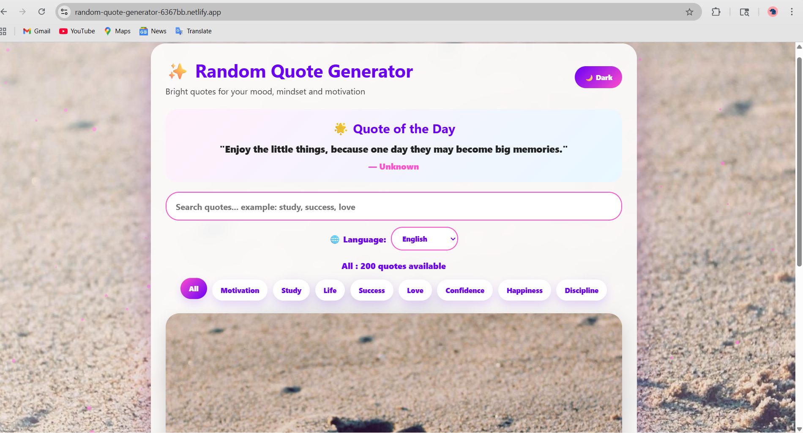

# ✨ Random Quote Generator

A colorful and interactive web app that generates inspiring quotes based on different moods and categories. Built using HTML, CSS, and JavaScript with advanced features.

---

## 🚀 Live Demo
🔗 https://random-quote-generator-6367bb.netlify.app

---

## 🌟 Features

- 🎯 200+ Quotes across multiple categories  
- 🌈 Dynamic Background Images for every quote  
- 🎙️ Voice Read Aloud (Text-to-Speech)  
- 🎵 Mood-based Background Music  
- 🌙 Dark / Light Mode Toggle  
- 🌐 Multi-language Support (Indian Languages)  
- 🔍 Search Quotes by keyword  
- 📌 Category Filter (Motivation, Study, Life, etc.)  
- ⭐ Save Favorite Quotes (localStorage)  
- 📤 Share to Twitter & WhatsApp  
- 📋 Copy Quote with one click  
- 🖼️ Download Quote as Image  
- 🌟 Quote of the Day  
- ✨ Smooth Animations + Particle Background  

---

## 🛠️ Tech Stack

- HTML5  
- CSS3  
- JavaScript (Vanilla JS)  
- Web Speech API  
- Translation API  
- Quotable API  

---
## 📌 Status
This project is completed and deployed successfully.

## 📂 Project Structure

## 📸 Screenshot

